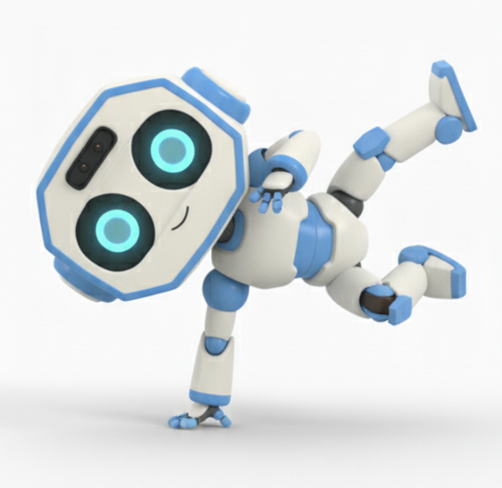

# p73_walker_controller


## 1. Purpose
`p73_walker_controller` is a ROS 2 control stack for the P73 humanoid walker in both simulation and real hardware modes.

Main goals:
- Estimate full robot state (joint, pelvis, IMU, actuator/system status).
- Run task/joint controllers (position control, task control, IK/CLIK mode).
- Publish standardized robot-state topics for GUI, logging, and external modules.
- Support the same control interface across MuJoCo simulation and real robot execution.

## 2. Robot states
Robot states are stored in `RobotEigenData` (inside `DataContainer::rd_`) defined in `p73_lib/include/p73_lib/robot_data.h`.

### 2.1 Time and model data
- `control_time_`, `control_time_us_`: control loop timestamp.
- `model_`, `data_`: Pinocchio model/data used for kinematics and dynamics.
- `link_`, `link_local_`, `ee_`: link and end-effector state containers.

### 2.2 Joint and virtual states
- `q_`, `q_dot_`, `q_torque_`: joint position, velocity, measured torque.
- `q_motor_`, `q_dot_motor_`, `q_torque_motor_`: motor-side position, velocity, and torque. These are only available on the real robot.
- `q_dot_lpf_`: filtered joint velocity.
- `q_virtual_`, `q_dot_virtual_`: floating-base generalized coordinates/velocity.

### 2.3 IMU and base orientation states
- `imu_ang_vel`, `imu_lin_acc`: IMU angular velocity and linear acceleration.
- `roll`, `pitch`, `yaw`, `yaw_init`: orientation states.
- `imu_euler_cov`, `imu_ang_vel_cov`, `imu_lin_acc_cov`: IMU covariance data.

### 2.4 Dynamics and task states
- `A_`, `A_inv_`, `C_`, `G_`: rigid-body dynamics terms.
- `J_task`, `e_task`, `task_dof`: task Jacobian, task error, task dimension.
- `torque_grav`, `torque_limit`, `torque_contact`, `torque_fric`: torque components.

### 2.5 Control gains and command states
- Gains: `Kp_m`, `Kd_m`, `Kp_j`, `Kd_j`, friction params (`tau_coulomb`, `tau_viscous`).
- Joint/motor command buffers:
  - `q_desired`, `q_dot_desired`, `torque_desired`
  - `q_motor_desired`, `torque_motor_desired`
- Four-bar mapping: `four_bar_Jaco_`, `four_bar_Jaco_inv_`.

### 2.6 ⚠️ Real robot remark ⚠️
When running on the real humanoid robot, the desired joint torque should be converted to motor torque before being sent to the actuators. This is necessary because the real hardware uses a joint-to-motor transmission mapping.

```cpp
if (!dc_.simMode) {
    rd_.torque_desired = WBC::JointTorqueToMotorTorque(rd_, rd_.torque_desired);
}
```
---

## 3. Prerequisites
### 3.1 Pinocchio
```
sudo apt install ros-jazzy-pinocchio
```
### 3.2 br_driver
```
git clone https://github.com/Bluerobin-DYROS/p73_sys_ws.git
cd p73_sys_ws
git submodule update --init --recursive
mkdir build && cd build
cmake .. -DCMAKE_BUILD_TYPE=Release
make -j$(nproc)
sudo make install
```
### 3.3 OSQP
```
cd ~/Downloads
git clone https://github.com/osqp/osqp
cd osqp
mkdir build && cd build
cmake -G "Unix Makefiles" ..
make
sudo make install
```
### 3.4 OSQP-Eigen
```
cd ~/Downloads
git clone https://github.com/robotology/osqp-eigen.git
cd osqp-eigen
mkdir build
cd build
cmake ..
make
sudo make install
```

### 3.5 etc
```
sudo apt update
sudo apt install -y libglfw3-dev
sudo apt install -y libncurses-dev
```

## 4. TODO

1. CHANGE GUI FOR P73_WALKER
